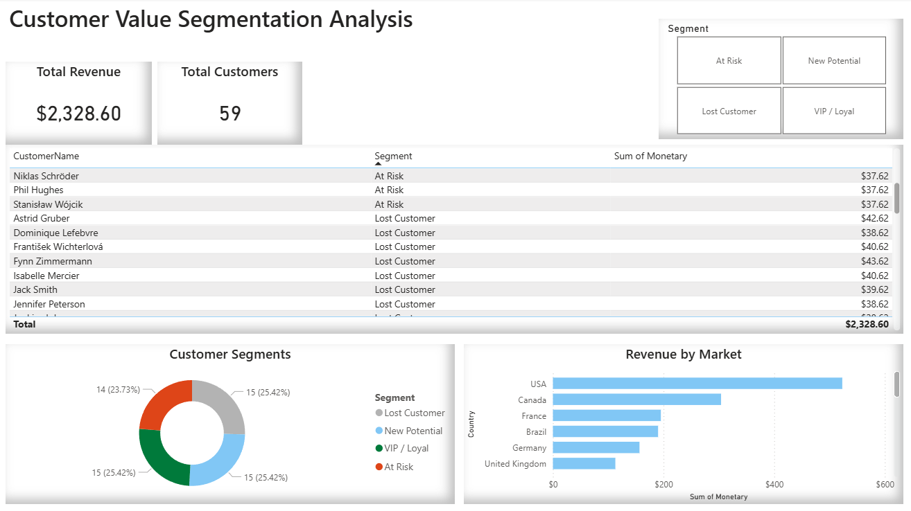

# Customer Value Segmentation (RFM Analysis)

## Project Overview
This project analyzes customer purchasing behavior from the Chinook Digital Media Store to identify high-value and at-risk customer segments. Using the **RFM (Recency, Frequency, Monetary)** technique, I classified customers to recommend specific marketing strategies.

## Technologies Used
* **SQL (SQLite):** Complex queries using CTEs and Window Functions for data extraction.
* **Python (Pandas):** Logic for RFM scoring and segmentation ranking.
* **Power BI:** Dashboarding for executive reporting.

## Key Insights
* **Balanced Segmentation:** The customer base is evenly split, with **25.4%** of users identified as "VIP/Loyal" and an equal **25.4%** identified as "New Potential" customers.
* **Churn Risk:** Approximately **23.7%** of the customer base falls into the "At Risk" category, representing a critical target for re-engagement campaigns.
* **Top Markets:** The **USA** is the leading revenue generator, followed by **Canada** and **France**, indicating where ad spend should be prioritized.

## Dashboard

